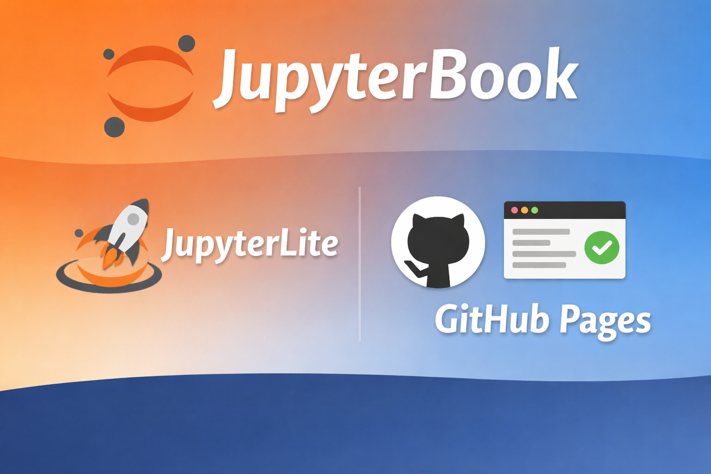

# Jupyter Book Template with Editable Pyodide Code Cells

<p align="center">
	
</p>

<p align="center">
	<a href="https://jupyterbook.org/">
		
	</a>
	<a href="https://jupyterlite.readthedocs.io/">
		
	</a>
	<a href="https://colab.research.google.com/">
		
	</a>
</p>

<p align="center">
	
	
	
	
</p>

A ready-to-use template for publishing notebook-based documentation on GitHub Pages using **JupyterBook v2 (MyST)** with native JupyterLite launch buttons.

## Overview

This template is built using **JupyterBook v2 (MyST)** and includes **interactive Pyodide-powered code cells** that execute Python entirely in the browser via WebAssembly. No backend is needed—everything runs client-side, making it ideal for deployment on GitHub Pages.

It also features an **in-page code editor with syntax highlighting**, enabling users to edit and run code directly within the browser, even in offline or fully browser-based environments.


**Live site:** <https://chandraveshchaudhari.github.io/jupyterbook2_with_lite_template/>   
**Repository:** <https://github.com/chandraveshchaudhari/jupyterbook2_with_lite_template>


## Quick Start

1. Click **Use this template** (or fork this repository).
2. Clone your new repository.
3. Edit **`myst.yml`** — set your title, author name, and GitHub URL.
4. Add content to `notebooks/` and register pages in `myst.yml` under `project.toc`.
5. Push to `main` — GitHub Actions builds and deploys automatically.

## Project Structure

```
myst.yml                   ← All config + table of contents (single source of truth)
intro.md                   ← Landing / home page
requirements.txt           ← Python dependencies
images/                    ← Static assets (project root — NOT inside a subfolder)
  banner_image.png
notebooks/                 ← Content pages (.ipynb and .md)
  adding_contents.ipynb
  features.ipynb
  section_markdown_page.md
extensions/                ← Optional helper script
  auto_notebook_creation_using_toc.py
.github/workflows/         ← GitHub Actions CI/CD
```

## Configuration (`myst.yml`)

```yaml
project:
  title: My Book Title
  authors:
    - name: Your Name
      github: your-github-username
  github: https://github.com/your-username/your-repo
  license:
    code: MIT
    content: CC-BY-4.0

  # Native JupyterLite launch button on every page (no Python scripts needed)
  jupyter:
    lite: true
    # binder:                       # optional Binder button
    #   repo: your-username/your-repo
    #   ref: main

  # Binder badge — shown directly on every page (no dialog)
  binder: https://mybinder.org/v2/gh/your-username/your-repo/HEAD

  banner: images/banner_image.png

  toc:
    - file: intro.md
    - title: Getting Started
      children:
        - file: notebooks/adding_contents.ipynb

site:
  template: book-theme
  options:
    logo: images/banner_image.png
    folders: true
```

## GitHub Deployment (No Local Build Required)

1. Go to `Settings → Actions → General` and allow workflows to run.
2. Go to `Settings → Pages` and set source to `GitHub Actions`.
3. Push to `main`.

Your site: `https://<your-github-username>.github.io/<your-repo-name>/`

## Local Preview (Optional)

```bash
pip install -r requirements.txt
jupyter book start        # live-reload preview at http://localhost:3000
jupyter book build        # static HTML → _build/html/index.html
```

## Launch Buttons

| Button | Where | Config |
|--------|-------|--------|
| ⚡ Power button | In-page JupyterLite execution (Pyodide/WASM kernel) | `project.jupyter.lite: true` |
| 🔵 Binder badge | Direct link to mybinder.org, shown on every page | `project.binder: https://mybinder.org/v2/gh/...` |
| 🟠 Colab badge | Each notebook's first cell (HTML `` link) | Update `href` in each notebook |
| 🚀 Rocket button | Dialog to enter any JupyterHub/BinderHub URL | Always present when `jupyter:` is set |

## Scaffold Notebooks from TOC (Optional)

```bash
python extensions/auto_notebook_creation_using_toc.py
```

Creates empty `.ipynb` files for every entry in `project.toc` of `myst.yml`.
